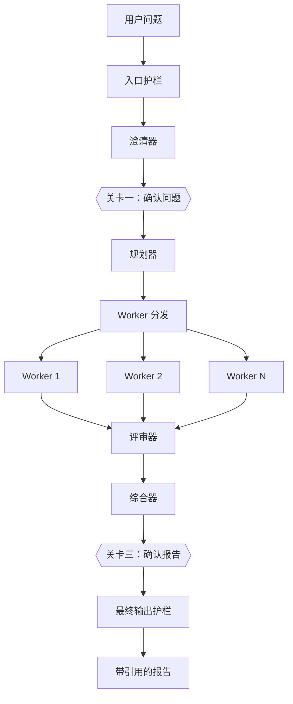

# 研究报告智能体（Research & Report Agent）

*[English](README.md) · 简体中文*

一个基于 Python + LangGraph 的多智能体系统：把一个宽泛的研究问题拆解、并行检索、自我审查，最后产出一份带引用的报告。

## 当前状态

**全栈 MVP，真实模型驱动。** 仓库包含 Python/LangGraph 编排器-工作者运行时、FastAPI 服务、SQLite 持久化，以及 React 控制台。planner、worker、critic、guardrail、synthesizer 全部调用真实模型。

## 它做什么

给定一个研究目标，例如：

> 对比三种主流动力电池化学体系的成本与安全性。

系统会：

1. 执行入口安全护栏（intake guardrail）
2. **改写问题并请你确认**（引导模式，见下文「两道确认关卡」）
3. 规划 3–6 个离散的研究任务
4. 用 LangGraph 并行分发 worker
5. 校验结构化发现与来源
6. 由 critic 审查质量
7. 在严格上限内重试、修订或重新规划
8. 综合成带引用的 Markdown 报告
9. **在交付前请你确认或要求重写**（引导模式）
10. 执行最终输出护栏
11. 向浏览器实时推送进度

## 架构



完整设计、契约、重试策略、护栏分类与验收标准见 [`docs/spec/design.zh-CN.md`](docs/spec/design.zh-CN.md)（英文原版：[`design.md`](docs/spec/design.md)，以英文版为准）。

## 两道确认关卡

**引导模式（Guided）** 下运行会在两处停下来等你：

| 关卡 | 位置 | 你要决定的事 |
|---|---|---|
| 确认问题 | 护栏之后、规划之前 | 这是不是你要研究的问题？可直接修改 |
| 确认报告 | 综合之后、交付之前 | 接受，还是让它重写？ |

**关卡一是唯一发生在花钱之前的检查点。** 一次小模型调用就能拦住被误解的问题，避免整轮规划与检索白费。

**重写只花一次综合调用，不产生任何新检索** —— 它复用已经落库的 findings。对报告不满意通常是措辞和结构问题，而不是证据问题；整轮重跑只会用同样的问题问同样的网页，得到差不多的结果。

**自主模式（Autonomous）** 全程不停顿。API 默认自主模式，控制台默认引导模式。

## 技术栈

Python 3.11+ · LangGraph · Pydantic · FastAPI · SQLAlchemy · React · TypeScript · Vite · asyncio · pytest · Ruff

## 本地开发

```bash
python3.11 -m venv .venv
source .venv/bin/activate
python -m pip install -e ".[dev]"
cd frontend
npm install
```

同时启动前后端：

```bash
./scripts/dev.sh
```

- 前端：http://127.0.0.1:5173
- 后端 API：http://127.0.0.1:8000
- API 文档：http://127.0.0.1:8000/docs

也可以分别启动：

```bash
.venv/bin/python -m uvicorn research_report_agent.main:app --host 127.0.0.1 --port 8000
```

```bash
cd frontend
npm run dev
```

## 配置模型

运行前需要配置模型 API Key。在控制台左下角点击 **Model API**：选择 **Provider**（OpenAI / DeepSeek / Anthropic，模型与 Base URL 会自动填入默认值），粘贴 Key 并保存。配置会写入被 gitignore 的 `model-config.json`。

`web_search` 本身不需要 Key，使用 DuckDuckGo 的无鉴权 HTML 接口。

等价的环境变量见 [`.env.example`](.env.example)：`AGENT_PROVIDER` / `AGENT_MODEL`，加上 OpenAI / DeepSeek 的 `OPENAI_API_KEY` / `OPENAI_BASE_URL`，或 Anthropic 的 `ANTHROPIC_API_KEY` / `ANTHROPIC_BASE_URL`。**`model-config.json` 的值优先于环境变量。**

- **OpenAI** 与 **DeepSeek** 都走 OpenAI Python SDK。任何 OpenAI 兼容网关也可以用：选 OpenAI 并填自定义 Base URL。
- **Anthropic** 走 Anthropic SDK 原生的 `messages.parse(output_format=...)` 结构化输出。Claude 的 Messages API 并不 OpenAI 兼容，所以在 `llm.py` 里是独立后端，而不是硬塞进 JSON 模式那条路径。

## API

| 方法 | 路径 | 用途 |
|---|---|---|
| `POST` | `/api/runs` | 创建并启动一次运行 |
| `GET` | `/api/runs` | 列出所有运行 |
| `GET` | `/api/runs/{run_id}` | 查询运行状态 |
| `DELETE` | `/api/runs/{run_id}` | 停止运行（进行中，或停在关卡上） |
| `DELETE` | `/api/runs/{run_id}/permanent` | 永久删除运行及其全部记录 |
| `POST` | `/api/runs/{run_id}/confirm` | 回应当前关卡并继续 |
| `POST` | `/api/runs/{run_id}/restart` | 用同一问题重新跑一次（新建运行） |
| `GET` | `/api/runs/{run_id}/tasks` | 列出规划出的任务 |
| `GET` | `/api/runs/{run_id}/attempts` | 列出不可变的 worker 尝试记录 |
| `GET` | `/api/runs/{run_id}/events` | 获取事件历史 |
| `GET` | `/api/runs/{run_id}/stream` | SSE 实时进度流 |
| `GET` | `/api/runs/{run_id}/report` | 获取结构化报告 |
| `GET` | `/api/runs/{run_id}/report.md` | 下载 Markdown |
| `GET` | `/api/runs/{run_id}/report.html` | 下载独立 HTML 报告 |
| `GET` | `/api/model-providers` | 内置 provider 预设 |
| `GET` | `/api/model-config` | 当前模型配置（Key 已脱敏） |
| `POST` | `/api/model-config` | 保存模型配置 |
| `POST` | `/api/model-config/test` | 测试模型连通性 |
| `GET` | `/health` | 健康检查 |

## 质量检查

```bash
ruff format --check .
ruff check .
pytest
```

```bash
cd frontend
npm run typecheck
npm run test -- --run
npm run build
```

每个 PR 的 GitHub Actions 会跑同样的检查。

## 仓库约定

- 在特性分支上开发
- 向 `main` 提 PR
- 合并前 CI 必须通过
- 使用 squash merge
- 提交保持聚焦，遵循 Conventional Commits
- 不要提交任何密钥

## 文档

- [设计规范（中文）](docs/spec/design.zh-CN.md)
- [Design specification (English, authoritative)](docs/spec/design.md)
- [贡献指南](CONTRIBUTING.md)
- [安全策略](SECURITY.md)

## 许可证

[MIT License](LICENSE)
