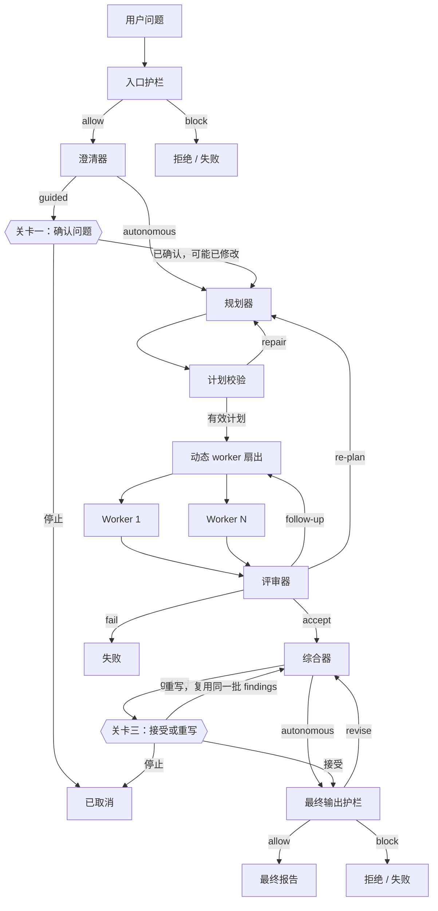

# 研究报告智能体 — 设计规范

*[English (authoritative)](design.md) · 简体中文*

> **英文版 [`design.md`](design.md) 是权威版本。** 本文覆盖同样的架构与决策，
> 但为中文读者做了压缩：代码块、契约 JSON 和表格保持原样（代码本身无语言差异），
> 散文部分重写而非逐字翻译。两者冲突时以英文版为准。

---

## 1. 概述

系统接收一个宽泛的研究问题，拆解为离散子任务，并行检索，审查结果，必要时重试或重新规划，最终产出一份带引用的报告。

输出包含：执行摘要、对比表、分维度分析、权衡与结论、置信度与不确定性、已知缺口、行内引用、来源附录。

## 2. 技术栈

Python 3.11+ · LangGraph（图拓扑、状态转移、扇出）· Pydantic（状态与消息契约）· asyncio · FastAPI · SQLite + async SQLAlchemy · SSE · React + TypeScript + Vite · pytest · Ruff

模型调用：OpenAI SDK（OpenAI、DeepSeek）+ Anthropic SDK（Claude），按 provider 分派，见 §22。

**持久化用 SQLite 领域表，刻意不使用 LangGraph checkpointer**，理由见 §23.1。

### 分工原则

LangGraph 负责图拓扑、状态转移与扇出。应用层仍然自己拥有：输入输出 schema、校验与修复策略、重试上限、预算执行、工具安全、终止规则、领域质量标准。

要点不是让框架替代智能体设计，而是把设计干净地实现在一个生产级图运行时之上。

## 3. 范围

**当前不做：** 分布式任务队列、认证、长期记忆、微调、部署。

**原本列为超范围、现已交付：**

| 原计划外 | 现状 | 章节 |
|---|---|---|
| Web UI | 侧栏工作区控制台 | §17 |
| 数据库后端 API | FastAPI + SQLite | §16 |
| 人工确认环节 | 引导模式下的两道关卡 | §23 |
| 流式进度 | SSE 进度流 | §16.2 |

## 4. 设计原则

### 4.1 图管转移，schema 管语义

LangGraph 决定下一个执行哪个节点；Pydantic 决定智能体的输出是否有效。**任何输出在通过 schema 校验和语义检查之前都不可信。**

### 4.2 编排器始终是策略所有者

图替代了手写控制循环，但重试上限、修订上限、重新规划上限、超时、并发、工具调用预算、token 预算、降级、拒绝行为，这些策略依然由应用显式持有。

### 4.3 每条事实主张都要有出处

一条 finding 不因为「听起来权威」就成立。它必须带：主张、证据、来源 ID、置信度、限制或假设。**综合器不得凭空造事实。**

### 4.4 失败是一等状态

系统必须预期：非法 JSON、schema 校验失败、缺失来源、低置信发现、互相矛盾、工具失败、限流、worker 超时、无限循环、预算耗尽、不安全的用户目标、不安全的生成内容、来自网页的提示注入。

### 4.5 每次运行都有边界

最长时长、最大并发 worker、单 worker 最大工具调用、最大检索总数、单任务最大重试、最大护栏修订、最大重新规划、最大 token 花费。

## 5. LangGraph 架构

### 5.1 高层图



关卡画成菱形是因为它们确实是判定点：运行会停下来等人。**关卡只在引导模式存在**，自主模式走直通路径，从不暂停。

### 5.2 状态机要点

- `INTAKE_GUARDRAIL → CLARIFYING`，随后按模式分叉到 `PLANNING`（自主）或 `AWAITING_CONFIRMATION`（引导）
- `SYNTHESIZING` 同样分叉到 `FINAL_GUARDRAIL`（自主）或 `AWAITING_REPORT_REVIEW`（引导）
- `AWAITING_REPORT_REVIEW` 可以回到 `SYNTHESIZING`（重写）或前进到 `FINAL_GUARDRAIL`（接受）
- 两个 `AWAITING_*` 阶段对应运行状态 `awaiting_input`，**既不是运行中，也不是终态**

### 5.3 图状态

关键字段（完整定义见英文版）：`run_id`、`goal`、`dimensions`、`plan`、`results`、`report`，加上关卡引入的三个：

- `mode` — `guided` 或 `autonomous`
- `resume_from` — 图的入口节点，见 §23.1
- `revision_instruction` — 重写报告时的用户指令

## 6. 各智能体职责

### 6.1 规划器（Planner）

把研究目标转成 3–6 个离散、互不重叠的研究任务。硬性约束（Pydantic 校验，违反即打回重试）：

- **任务数必须在 3–6 之间**
- `task_id` 唯一，依赖不得自指、不得指向不存在的任务、不得成环
- 每个任务至少一条 `success_criteria`，`required_tools` 只能取自 `["web_search", "fetch_page", "calculator"]`
- 必须覆盖用户指定的每个 dimension（见 §17.3）

### 6.2 Worker

在 ReAct 循环里执行单个任务，受 `max_reasoning_steps` 和 `max_tool_calls_per_attempt` 双重约束。输出 `WorkerResult`：summary、findings、sources、gaps。每条 finding 必须至少绑定一个 source。

### 6.3 评审器（Critic）

逐任务给出裁决：`accept` / `revise` / `replan` / `degrade`。`revise` 必须附带一个更窄的 follow-up 问题（`max_tool_calls <= 3`）。

follow-up **替换**原任务的结果，不新增任务 —— 所以任务总数在整个运行生命周期内恒定为 3–6。且 `attempt_count >= 2` 时跳过，每个任务最多修订到第二次尝试。

### 6.4 护栏（Guardrail）

两处执行：入口（判断意图）和最终输出（判断内容）。裁决为 `allow` / `revise` / `block` / `escalate`。检查项分类见英文版 §6.4。

### 6.5 综合器（Synthesizer）

从**已接受的** findings 和 sources 生成报告。规则：

- 只用给定的 findings 和 sources，绝不发明新事实或新引用
- `finding_id` 是内部记账，**绝不能出现在报告正文里** —— 读者无法解析它
- 正文里唯一允许的行内引用是编号来源标记，如 `[1]`
- 每个用户指定的 dimension 单独成节（对比类问题则单独成列），证据实际未覆盖时要在 limitations 里说明

综合器还接受可选的 `revision_instruction`（关卡三，§23）。此时它被明确告知**没有新证据**：只能用现有 findings 重写，或在 limitations 里说明该要求无法满足。这就是重写只花一次模型调用、不产生任何检索的原因。

### 6.6 澄清器（Clarifier）

> 编号在最后，但**运行在最前** —— 位于入口护栏和规划器之间。前面几节按流水线顺序编号，本节是后加的，保持既有编号稳定比重排更有价值。

**目的：** 把用户的问题改写成研究者实际会回答的那个精确问题，并在引导模式下让用户有机会在花钱之前纠正它。

它所在的位置是图中唯一一个「误解还免费」的点。之后的每个检查点，钱都已经花在检索和模型调用上了。

输出契约：

```json
{
  "intent": "...",
  "rewritten_goal": "...",
  "rationale": "一句话，对用户说明改了什么",
  "assumptions": ["用户没说、但你替他决定了的事"],
  "suggested_dimensions": ["最多 2 个"]
}
```

规则：

- 保留意图。收窄含糊，**绝不替换主题**，也绝不悄悄放宽一个刻意收窄的问题
- 原问题已经足够精确时，几乎原样返回并说明，而不是为了显得有用而编造修改
- `assumptions` 之所以存在，是因为这里真正的失败模式是**无声的范围选择** —— 时间范围、地域、人群。把它们说出来，才是这道关卡值得停一下的理由
- 绝不回答问题，绝不自己去检索

**为什么自主模式下改写只是参考：** 自主模式保留用户原始措辞，只把澄清结果当上下文。在没人同意替换的情况下去研究另一个问题，比研究一个略显宽泛的问题更糟。

## 7. 执行策略

### 7.1 并发

调度是**批次模型，不是流水线模型**：每轮取出至多 `max_parallel_workers` 个就绪任务，`asyncio.gather` 等整批完成再进下一轮。

代价是一批里最慢的那个决定整批耗时 —— 快的任务完成后槽位会空转。这是为了简单可预测做的取舍，不是 bug；如果研究阶段感觉慢，这里是第一个该看的地方。

### 7.2 重试与失败

单任务重试上限、修订上限、重新规划上限都由 `RunBudget` 持有。任何一个循环都必须有显式终止条件。

### 7.5 终止状态

| 状态 | 含义 |
|---|---|
| `COMPLETE` | 从已接受的证据产出了报告 |
| `COMPLETE_WITH_CAVEATS` | 部分报告，已披露局限 |
| `FAILED` | 无法产出有用报告，或内容被拦截 |
| `BLOCKED` | 入口护栏在任何检索之前拒绝了目标 |
| `CANCELLED` | 用户或系统停止了运行 |

**`AWAITING_INPUT` 刻意不在这张表里。** 停在关卡上的运行是暂停，不是结束：它持有已规划的任务，保留已累积的花费，被回应后会继续。把它当终态，正是早期版本导致关卡「停不掉」的原因 —— cancel 拒绝一切非 `RUNNING` 的运行，于是停在关卡上的运行只能删除。停止一个停在关卡上的运行是通向 `CANCELLED` 的正常转移。

## 9. 安全控制

- **网页内容是不可信输入**，工具输出绝不能被当作系统指令
- **模型输出同样不可信**，因为它可能吸收了抓取到的网页内容
- 抓取必须有超时、响应大小上限、内容类型白名单，并拒绝内网与回环地址
- 报告文本通过转义文本节点渲染，绝不用 `dangerouslySetInnerHTML`
- 任何 URL 在成为链接之前必须限制为 `http`/`https` —— 否则一条 `javascript:...` 的来源 URL 会在控制台和导出的 HTML 报告里成为可点击的执行入口
- 不提供个性化的医疗、法律、金融建议

## 15. 编排器-工作者运行时

worker 尝试记录（attempt）是**不可变**的。重试和修订产生新的 attempt，不修改旧的 —— 这是让 trace 可信的根本约束。attempt id 按运行隔离。

## 16. 后端 API

完整路由表见 [README.zh-CN.md](../../README.zh-CN.md)。几处设计决策：

**删除不与取消共用路由。** 停止一次运行和销毁它是两种不同意图，不能只差一个按键。破坏性的那个在路径里带 `permanent`，且运行进行中时返回 `409`。

**`POST /confirm` 的行为取决于它回应的关卡：**

| 关卡 | 请求体 | 效果 |
|---|---|---|
| `confirm_question` | `{}` 或 `{goal?, dimensions?}` | 从 `plan` 恢复，用确认或修改后的问题 |
| `confirm_report` | `{"decision": "accept"}` | 从 `final_guardrail` 恢复 |
| `confirm_report` | `{"decision": "rewrite", "instruction": "..."}` | 从 `synthesize` 恢复，复用已有 findings |

它要求运行状态仍是 `awaiting_input`，而不只是「挂着一个关卡」。早期版本只检查关卡是否存在，结果**一个已停止的运行可以通过自己的残留关卡被恢复**。

### 16.4 数据库迁移

`create_all` 只创建缺失的**表**，不会改动已存在的表。因此后加的列在任何早于它的数据库上都是静默缺失的，对该表的每次查询都会失败。**测试永远抓不到这个问题**，因为测试每次都新建内存 schema。

`create_schema` 因此在启动时应用增量列迁移，由一份紧挨着模型定义的小注册表驱动。它刻意只支持加列 —— 幂等、每次启动跑都安全。任何需要回填、改类型或删列的变更应该换成真正的迁移工具，那也是替换掉这套机制的时机，而不是扩展它。

## 17. 前端设计

### 17.1 技术栈

React · TypeScript · Vite · TanStack Query · 原生 `EventSource`。**无路由** —— 状态放在 `App.tsx`。

### 17.2 侧栏工作区布局

1. **运行侧栏**（`RunRail`）：全部运行，按 `今天` / `更早` 分组，状态色条无需读文字即可分辨。**右键**弹出 停止 / 重新开始 / 删除。

   删除放在右键菜单而不是卡片上，是因为每个标题旁边都摆一个可见的删除按钮，离误删一份完成的报告只有一次手滑；右键几乎不可能误触。「重新开始」这个名字是准确的 —— restart 创建的是**新运行**，而不是恢复当前这个，叫「开始」会承诺一个不存在的恢复行为。注意右键在触屏上没有等价操作，长按是后续可做的补充。

2. **输入区**（`ChatComposer`）：提交后**立即打开新运行的工作区**，而不是把用户留在输入页。

3. **运行工作区**（`RunWorkspace`）：
   - **进度骨架**（`ProgressSpine`）：后端 15 个 `RunPhase` 收敛成人真正关心的 5 个阶段 —— 检查、规划、研究、审查、写作。修复类阶段（`plan_repair`、`worker_repair` 等）**刻意不显示为前进**，而是落在受影响的任务上
   - Worker 行显示任务的**真实问题**，不是 `task_00N`
   - **关卡**在运行暂停时渲染在骨架上方（§23）
   - 暂停中的阶段显示静态标记和「等你确认」，**不能在运行已停止时还播放进行中动画**

4. **Trace 检查面板**（`Inspector`）：预算计数、计划与逐任务尝试摘要、事件日志。任何步骤的错误都在这里呈现，不被吞掉。

### 17.3 研究维度（dimensions）

一个 dimension 是**覆盖契约**：用户要求报告必须涉及的一个角度。`RunCreateRequest.dimensions` 是自由 `list[str]`（上限 5），不是枚举。

预设是**视角，不是主题**。最初那四个（`cost`、`safety`、`performance`、`supply chain`）来自电池示例，无法泛化 —— `supply chain` 对监管类问题毫无意义，`performance` 对劳动经济学问题也是。现在这组之所以适用于几乎任何问题，是因为它们描述的是**答案的形状**而不是主题领域：`cost`、`risks`、`tradeoffs`、`alternatives`、`track record`，再加一个自由输入。

两条由传播路径推出的规则：

- **默认一个都不选。** 之前默认勾选会让无关问题把它们悄悄带进规划提示词，白白花掉任务名额
- **界面上限 4 个**（低于 API 的 5）。规划器只产出 3–6 个任务，它被要求覆盖的每个 dimension 都会占掉一个名额。最初定 2 正是这个理由；改成 4 是刻意用规划器的自由度换用户的控制权，代价是四个的时候大半个计划在规划器自主拆解之前就已经被占满

dimensions 抵达两个智能体：**规划器**收到它作为覆盖要求，**综合器**收到后给每个 dimension 单独成节。

`covered_dimensions`（worker 侧）和 `missing_dimensions`（critic 侧）两个字段已经产出并落库，但**目前没有任何代码消费它们**。

## 23. 人工确认关卡

**关卡**是运行停下来等人的位置。关卡只存在于引导模式；自主模式从不暂停，且 API 默认自主，因此既有客户端不受影响。

### 23.1 为什么不用 LangGraph checkpointer

显而易见的实现是 `graph.compile(checkpointer=...)` 加 `interrupt()` / `Command(resume=...)`。这个方案被考虑过并**否决了**。

`SupervisorState` 承载的所有东西**已经持久化在领域表里**：计划在 `tasks`，结果在 `attempts`，报告在 `reports`，goal 和 dimensions 在运行行上。checkpointer 会把 `storage.py` 已经妥善拥有的数据再序列化一份不透明副本，留下两个可以各自漂移的真相源，并且让可恢复状态变成一个 blob，而不是能用一条 SQL 查看的东西。

取而代之，图有**多个入口点**，恢复就是一次从更靠后位置进入的新调用：

```python
graph.add_conditional_edges(
    START,
    self._route_entry,
    {
        "intake_guardrail": "intake_guardrail",  # 新运行
        "plan": "plan",  # 问题已确认
        "synthesize": "synthesize",  # 重写报告
        "final_guardrail": "final_guardrail",  # 报告已接受
    },
)
```

内存里没有的状态从写入它的表里重建 —— `_load_results` 从 `attempts` 重建 worker 结果，每个任务取**最新**一次尝试，因为更早的已被重试或 critic 修订取代。

取舍是明确的：一个恢复点要付出少量重建代码，换来单一真相源。**如果将来关卡需要停在节点内部而不是节点之间，这个算式就变了**，那时 checkpointer 才是正确答案。

### 23.2 两道关卡

| 关卡 | 位置 | 问的问题 | 恢复入口 |
|---|---|---|---|
| `confirm_question` | 入口护栏后、规划前 | 这是要研究的问题吗？ | `plan` |
| `confirm_report` | 综合后、最终护栏前 | 接受这份报告，还是要改？ | `final_guardrail` 或 `synthesize` |

**关卡一是唯一发生在花钱之前的检查点。** 之后的一切都是在评判已经付过钱的工作 —— 这也是澄清器（§6.6）值得单独一次模型调用的原因。

**关卡三放在综合之后，而不是文件导出之前。** 不存在一个独立的「写文件」步骤可以拦截：`markdown` 由综合器产出，`report.md` / `report.html` 只是已存报告的序列化器。综合是内容仍未确定的最后一刻。

**重写**从 `synthesize` 重新进入，带上 `revision_instruction`，findings 从 `attempts` 重新载入 —— 一次模型调用，零检索。它排在「整轮重跑」之前，因为对报告的不满大多是措辞而非证据问题，而重跑只是用同样的问题问同样的网页，到达差不多的地方。重写之后**再次停在关卡上**，而不是自动交付。

### 23.3 暂停的运行必须保住什么

关卡把一个假设变成了硬要求：在它们之前，运行始终在一个连续的后台任务里执行，所以编排器的内存计数器在其整个生命周期内都是对的。

一个暂停后又恢复的运行 —— 在新进程里，或重启之后 —— 必须带着它已有的花费回来。`_hydrate` 在 `_run_supervisor` 开头从数据库恢复 usage、budget 和事件计数器。没有它：

- 预算上限会拿 0 去比，于是**暂停等于给配额续杯**，`max_retries_per_task` / `max_replans` 可以被无限绕过
- 每次运行的自定义预算会悄悄退回默认值
- 事件计数器会重新签发已经存在的 id

usage 在每次阶段切换、每个 worker attempt 完成后、以及关卡打开之前都会落库。只在 `_finish` 写库意味着进行中的运行一直报 0，而**停在关卡上、永不终结的运行则从未记录过自己的花费**。

### 23.4 停止与恢复

停在关卡上的运行是可停止的（§7.5）。`set_terminal` 会清掉 `pending_gate`，`/confirm` 要求状态仍是 `awaiting_input` —— 两者都必要，因为一个保留着关卡的终态运行可以被通过它恢复。

### 23.5 尚未实现的关卡

**关卡二**（审查前调整研究）已规范但未实现。它应该放在 critic **之后**而不是之前：critic 本来就会产出人类在无辅助时要自己形成的那份逐任务判断，先跑它能把这道关卡从「读五份任务结果」变成「同意或不同意一个裁决」。

它还需要**超时自动放行** —— 研究是最长的阶段，一道阻塞关卡放在那里，会把用户已经离开的运行永远搁浅。

## 24. 视觉系统

调色板作为 CSS 自定义属性定义在三个块里 —— 裸 `:root`（浅色）、`@media (prefers-color-scheme: dark)`（用 `:root:not([data-theme="light"])` 保护）、`:root[data-theme="dark"]` —— 这样三种主题状态（显式浅色、显式深色、未标记的系统默认）都能解析成完整集合。

**任何组件规则里都不允许出现颜色字面量。** 只在某个主题块里定义的颜色，是导致页面在另一个主题下不可读的经典 bug。

### 24.1 阶段色

五个阶段用**三种**色相，不是五种，因为分组本身才是信息：**验证**（检查、规划）、**采集**（研究、审查）、**产出**（写作）。五种色相只会编码位置 —— 而位置顺序本来就已经告诉你了。

### 24.2 填充色与文字色是两套 token

鲜艳和可读互相拉扯。在浅色底上实测，展示用的鲜艳值作为文字远远不够 —— 薄荷 2.51:1、琥珀 1.84:1、珊瑚 2.83:1 —— 而把它们压暗到达标会得到一套灰扑扑的配色，那就完全违背了选它们的初衷。

因此每个色相有两个 token：**鲜艳值**用于填充（圆点、勾选、侧栏色条、进度条、按钮），**加深的 `-ink` 值**只用在颜色本身是需要阅读的字形时。所有文字组合实测都不低于 4.5:1。深色模式下亮色相在暗底上本就有对比，所以 ink 与 fill 同值，**没有任何一处被压暗**。

语义色（ok / warn / crit）与主色是**互相独立的一条轴**，且必须保持独立：一个可能被误认为品牌色的状态绿，就不再传达状态了。
